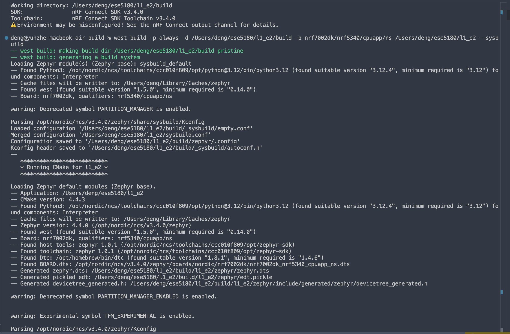
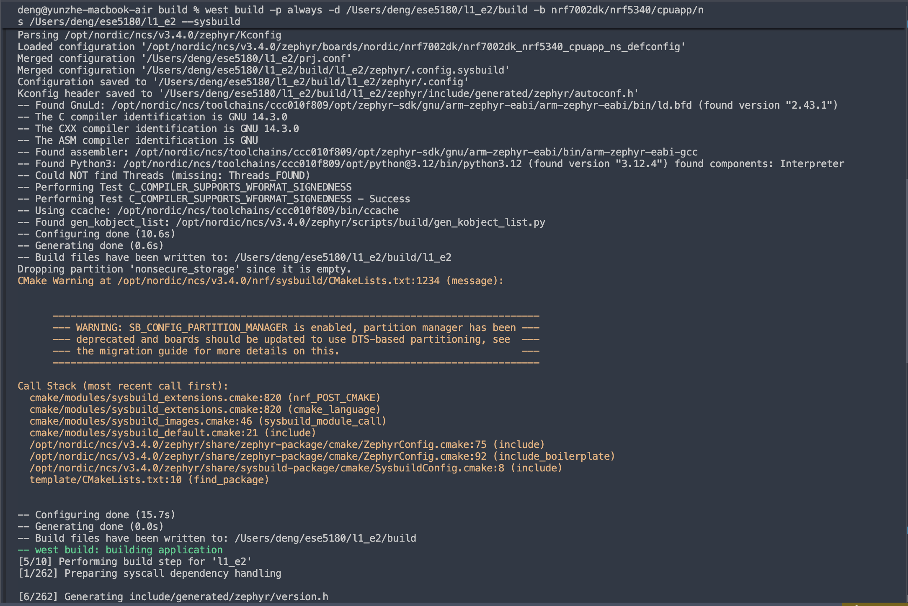
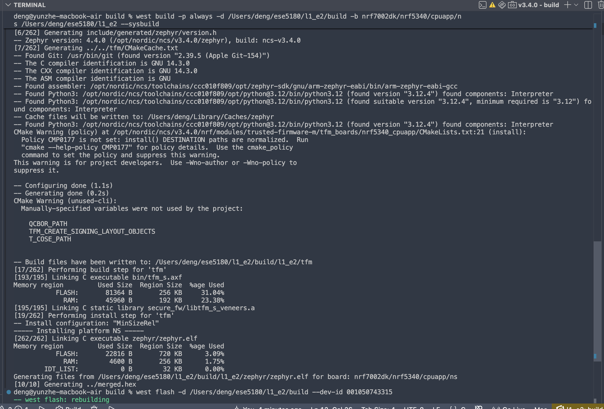
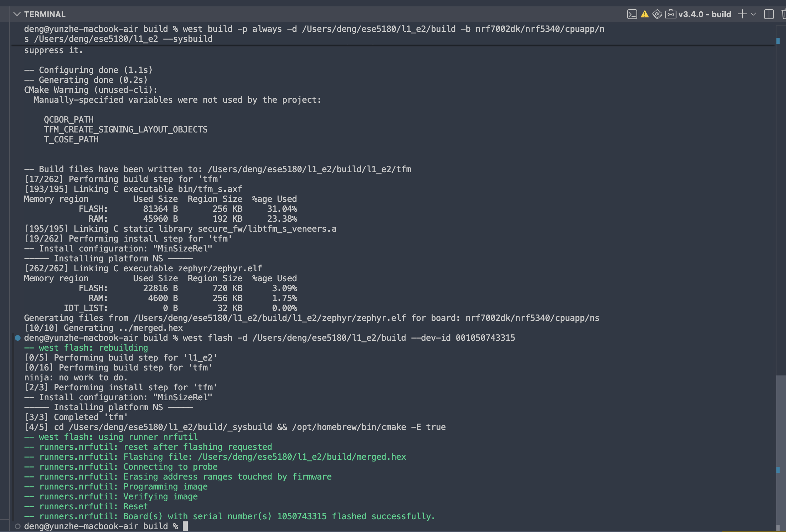
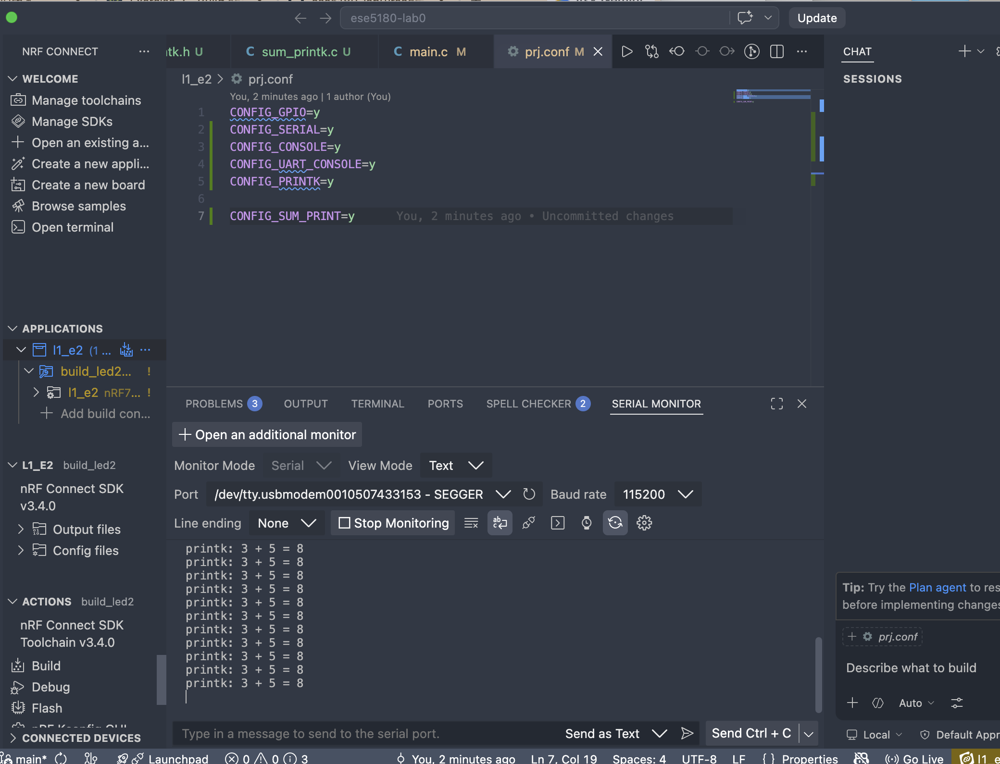
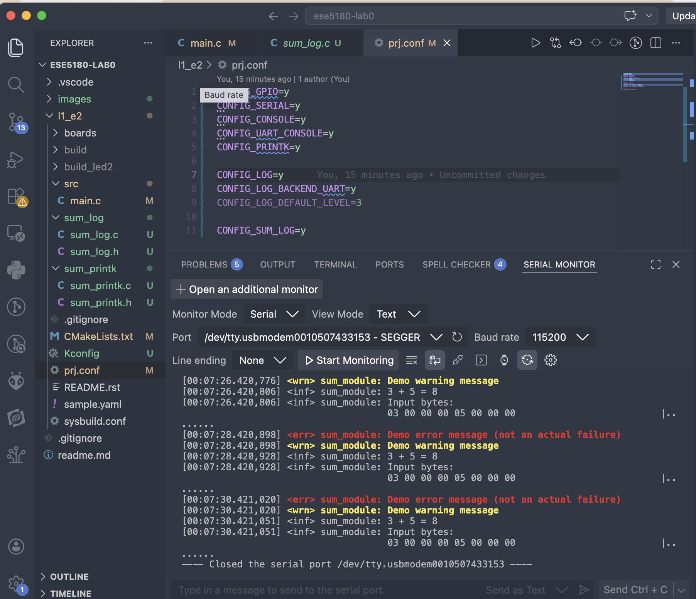
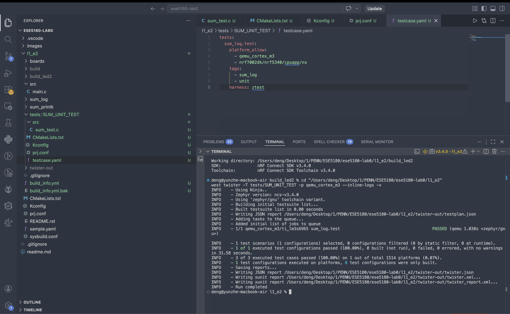
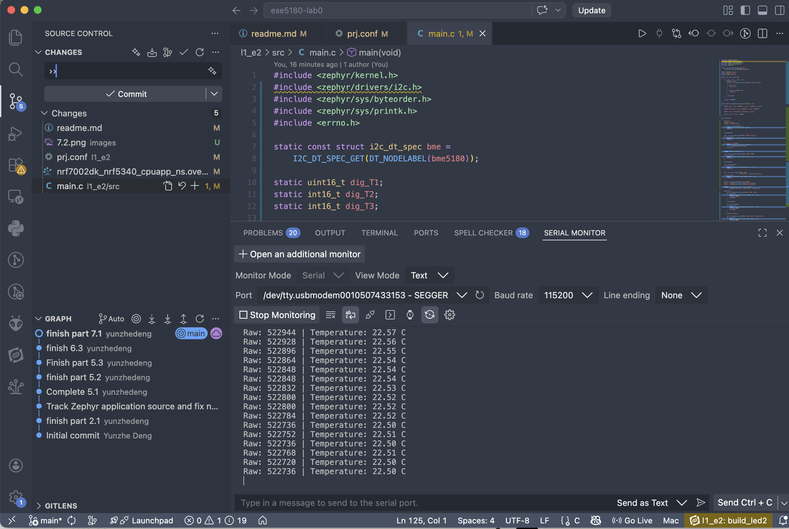
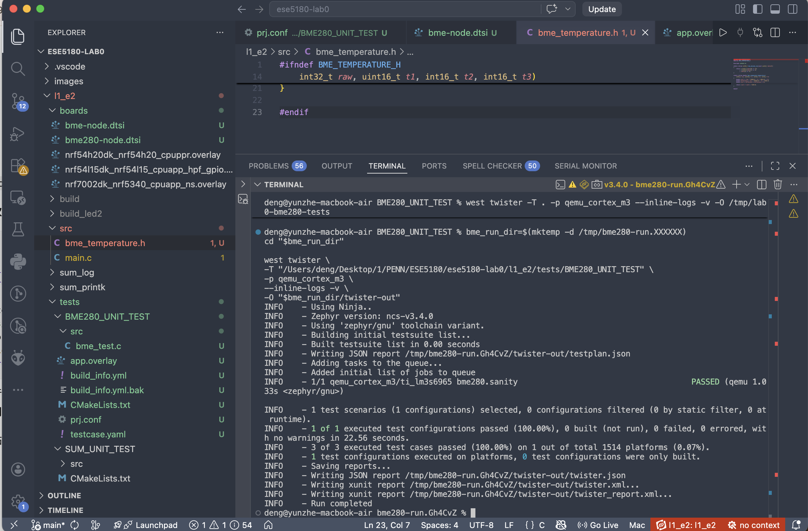

# ESE5180: Lab 0 Zephyr

| Team Member Name | Email Address               |
| ---------------- | --------------------------- |
| Yunzhe Deng      | deng1@engineering.upenn.edu |

**GitHub Repository URL: https://github.com/yunzhedeng/ese5180-lab0.git**

## 1. 3.1 Terminal Prints

## 2. 6.1 Console Output

Printk

Logger

## 3. 7.2 Testing Outputs

## 4. 8.1 Temperature Screenshots

## 5. 8.2 Ztest Screenshots

